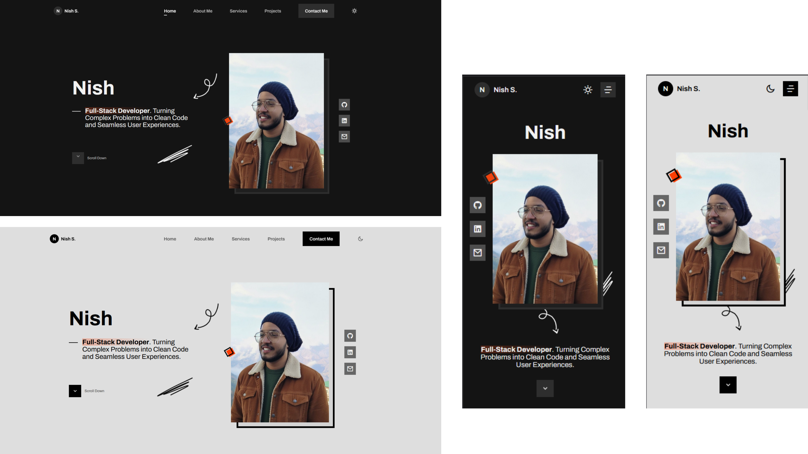

# 🧑‍💻 Nish S. – Portfolio Website

A modern, responsive, and elegant **personal portfolio website** built to showcase my skills, projects, and services as a **Full Stack Web Developer**.

## Cover

This portfolio is designed with a focus on **clean UI, smooth UX**, and a **dark/light theme toggle** for accessibility and aesthetics.

---

## 🚀 Features

-  🎨 **Modern UI/UX** — Sleek, minimal design with smooth transitions
-  🌗 **Dark / Light Mode** — Toggle theme with user preference saved in localStorage
-  ⚙️ **Responsive Design** — Fully optimized for all devices
-  💬 **Email Contact Form** — Integrated with [EmailJS](https://www.emailjs.com/)
-  🧠 **Scroll Reveal Animations** — Smooth section fade-ins on scroll
-  🧩 **Reusable Components** — Structured, scalable HTML/CSS layout
-  🖼️ **Lazy Loaded Images** — Optimized for performance
-  🔒 **Secure External Links** — Uses `rel="noopener noreferrer"`

---

## 🏗️ Tech Stack

| Category                   | Technologies                       |
| -------------------------- | ---------------------------------- |
| **Frontend**               | HTML5, CSS3, JavaScript (ES6)      |
| **Frameworks / Libraries** | EmailJS, ScrollReveal, Remix Icons |
| **Design Tools**           | Figma                              |
| **Hosting**                | GitHub Pages                       |
| **Version Control**        | Git / GitHub                       |

---

---

## 💡 Sections Overview

### 🏠 **Home**

-  Hero introduction with name, role, and social links.
-  Interactive scroll-down indicator.

### 👨‍💻 **About**

-  Brief introduction, core development philosophy, and skill badges.
-  Contact and LinkedIn call-to-action buttons.

### 🛠️ **Services**

-  Highlights of what I offer — from full-stack development to consulting and DevOps.

### 💼 **Projects**

-  Portfolio of real and demo projects with GitHub and live links.

### ✉️ **Contact**

-  Email form (powered by EmailJS).
-  Alternative social media contact section with icons.
